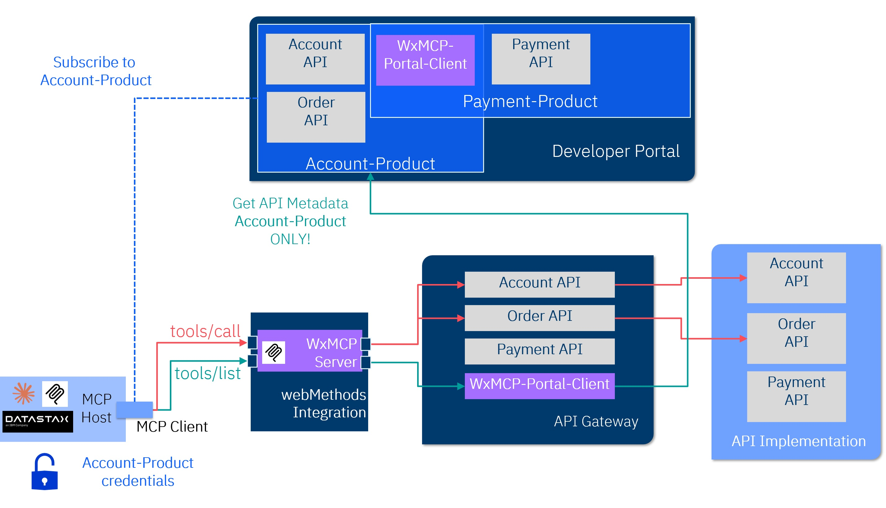

# WxMCPServer

**WxMCPServer** is a webMethods Integration Server (IS) package that implements an MCP Server for IBM webMethods Hybrid Integration (IWHI).  
It requires either **webMethods Integration Server** or **webMethods Microservices Runtime** for hosting.

## Overview

WxMCPServer enables you to expose your existing APIs — including their associated API Gateway policies (e.g., logging, authentication, API Key, or OAuth2) — as **MCP Tools** through an enterprise-grade integration platform.  

It leverages your existing API management infrastructure:

- **Developer Portal** — used to look up APIs to be exposed as tools  
- **API Gateway** — enforces policies such as logging, authentication, and authorization  

In the current solution approach, the **Portal Client API** is grouped together with business APIs into an API product. This API product is then used to retrieve metadata (including the [OpenAPI](https://www.openapis.org/) specification) for all APIs in the product.

## Platform Support

While there are pre-configured assets for webMethods available, any API management platform **can** be used — only the current `WxMCPServer` implementation is bound to webMethods-specific APIs.  
To integrate with non-IBM API management solutions, you must implement the **Portal Client API** interface (OpenAPI specification).

## Key Benefits

- Reuse existing corporate APIs as AI-accessible MCP tools  
- Retain existing API Gateway security and policy enforcement  
- Integrate seamlessly with Developer Portals for API discovery  
- One API key or access token can access the Portal Client API and all business APIs in the same API product

## Roles and Responsibilities

- **MCP Host** and **MCP Client** — External components (not part of this solution) essential for using the tools; examples include Claude Desktop or Langflow  
- **WxMCPServer** — webMethods IS package implementing the MCP Server  
- **API Gateway** — Hosts business APIs (to be exposed as MCP tools) and the Portal Client API to extract API metadata from the Developer Portal  
- **Developer Portal** — Allows AI developers to request access to API products and retrieve API keys or OAuth credentials

The following graphic provides an overview of the architecture:



## WxMCPServer Requirements

WxMCPServer requires the following components:

- MCP Host and Client (e.g., Claude Desktop, Langflow, or similar)
- webMethods API Gateway with Portal Client API implemented  
  ([Specification](resources/APIs/Portal-Client/MCP-Portal-Client-1-0.yml) —  
  [Preconfigured API Archive](resources/exports/webMethods-API-Gateway/WxMCP-Portal-Client.zip))
- webMethods WxMCP-Server-API hosted on API Gateway  
  ([Specification](resources/APIs/WxMCP-Server/WxMCP-Server-API-1.3.yaml))
- This IS package deployed on webMethods Integration Server or Microservices Runtime (11.x or higher)

## Integration Server Global Variables

You can set default values for `WxMCPServer`, which are used if no corresponding HTTP headers are sent.

*Note:* MCP client HTTP headers **always** take precedence over default values.

| Variable Name                    | Required | Default Value                   | Description |
|----------------------------------|----------|----------------------------------|-------------|
| `wxmcp.cache.manager.name`       | No       | `WxMCP_Cache_Manager_Default`   | The name of the Cache Manager to be used. |
| `wxmcp.auth.type`                | Yes      | (none)                           | Authentication type: `"OAUTH"` or `"API_KEY"`. |
| `wxmcp.portal.client.base.url`   | Yes      | (none)                           | Base URL of your Portal Client API on API Gateway, e.g., `https://myAPIGateway/gateway/MCP-Portal-Client/1.0` |
| `wxmcp.api.key.headername`       | Conditional | (none)                        | Used only when `wxmcp.auth.type` = `"API_KEY"`. Specifies the API key header name. |
| `wxmcp.tool.header.prefix`       | No       | `header_`                        | Default prefix for tool header properties. |
| `wxmcp.tool.query.prefix`        | No       | `query_`                         | Default prefix for tool query parameter properties. |
| `wxmcp.tool.path.prefix`         | No       | `path_`                          | Default prefix for tool path parameter properties. |
| `wxmcp.tool.response.mode`       | No       | `both`                           | Tool response format: `text`, `structured`, or `both`. |
| `wxmcp.response.code.mode`       | No       | `stdio`                          | Response mode: `"stdio"` (always HTTP 200) or `"http"` (actual status codes). |

## Configuration Examples

### Claude Desktop — API Key

```
{
  "mcpServers": {
    "mcp-iwhi-apikey-demo": {
      "command": "npx",
      "args": [
        "-y",
        "mcp-remote",
        "http://<Integration Server Host>:<Integration Server Port>/mcp",
        "--header",
        "auth_type:API_KEY",
        "--header",
        "api_key:<The API Key>",
        "--header",
        "portal_client_base_url:https://<webMethods API Gateway Host>:<webMethods API Gateway Port>/gateway/MCP-Portal-Client/1.0",
        "--header",
        "api_key_headername:<Your API Key header - i.e. x-Gateway-APIKey for webMethods>",
        "--header",
        "tool_header_prefix:header_",
        "--header",
        "tool_query_prefix:query_",
        "--header",
        "tool_path_prefix:path_",
		"--header",
		"tool_response_mode:structured",
		"--header",
		"response_code:http"
      ]
    }
  }
}
```

### Claude Desktop — OAUTH style

```
{
  "mcpServers": {
    "mcp-iwhi-oauth-demo": {
      "command": "npx",
      "args": [
        "-y",
        "mcp-remote",
        "http://<Integration Server Host>:<Integration Server Port>/mcp",
        "--header",
        "auth_type:OAUTH",
        "--header",
        "portal_client_base_url:https://<webMethods API Gateway Host>:<webMethods API Gateway Port>/gateway/MCP-Portal-Client/1.0",
        "--header",
        "oauth_bearer_token:<The bearer token>",
        "--header",
        "tool_header_prefix:header_",
        "--header",
        "tool_query_prefix:query_",
        "--header",
        "tool_path_prefix:path_",
		"--header",
		"tool_response_mode:structured",
		"--header",
		"response_code:http"
      ]
    }
  }
}
```

### DataStaX/Langflow MCP Server - API Key style 

```
npx -y mcp-remote http://<Integration Server Host>:<Integration Server Port>/mcp \
--header "auth_type:API_KEY" \
--header "portal_client_base_url:https://<webMethods API Gateway Host>:<webMethods API Gateway Port>/gateway/MCP-Portal-Client/1.0" \
--header "api_key:<The API Key>" \
--header "api_key_headername:<Your API Key header - i.e. x-Gateway-APIKey for webMethods>" \
--header "tool_header_prefix:header_" \
--header "tool_query_prefix:query_" \
--header "tool_path_prefix:path_" \
--header "tool_response_mode:both" \
--header "response_code:stdio"
```

### DataStaX/Langflow MCP Server - OAuth style 

```
npx -y mcp-remote http://<Integration Server Host>:<Integration Server Port>/mcp \
--header "auth_type:OAUTH" \
--header "portal_client_base_url:https://<webMethods API Gateway Host>:<webMethods API Gateway Port>/gateway/MCP-Portal-Client/1.0" \
--header "oauth_bearer_token:<The bearer token>" \
--header "tool_header_prefix:header_" \
--header "tool_query_prefix:query_" \
--header "tool_path_prefix:path_" \
--header "tool_response_mode:both" \
--header "response_code:stdio"
```

## Setup (webMethods API Gateway)

A pre-configured **Portal Client API** archive is available for webMethods API Gateway.  
Import this archive to create the `WxMCP-Portal-Client` API in API Gateway.  

Then update the credentials in the **`wxmcp-portal-credentials`** alias with the technical user's credentials that can access the **webMethods Developer Portal**.

## Limitations

- Only OpenAPI 3.x specifications in **JSON format** are supported.  
  (No issue for webMethods API Gateway, but third-party gateways may require conversion.)
- Only `"Content-Type": "application/json"` is supported for sending and receiving.