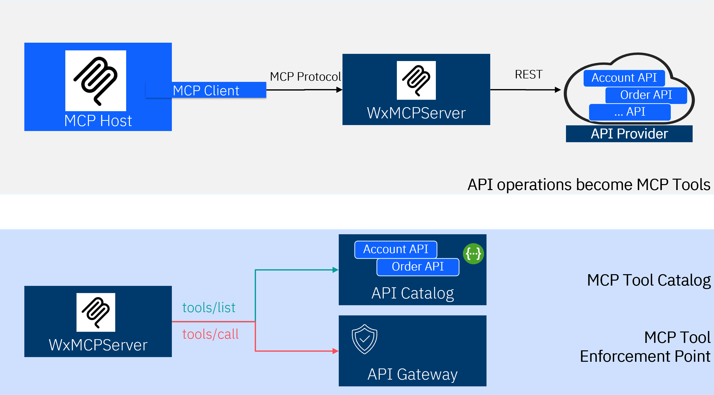

# WxMCPServer

**WxMCPServer** is a webMethods Integration Server (IS) package that implements an [MCP Server](https://modelcontextprotocol.io/specification/2025-06-18) (currently as of 18-06-2025) for IBM webMethods Hybrid Integration (IWHI).  
It requires either **webMethods Integration Server** or **webMethods Microservices Runtime** for hosting.
## What's New
**v1.5.0 (Dec 18, 2025)** 
- Introduced new header names, please refer to latest [WxMCPServer 1.5 API specification](/resources/APIs/WxMCP-Server/WxMCP-Server-API-1.5.yaml)
- Introduced new webMethods IS endpoint `https://<server>:<port>/v1_5_0/mcp`
- Introduced on-demand loading of tools. If tools are not presented in local cache (i.e. due to refreshing the package), they are loaded even without enforcing "tools/list"
## Table of Contents

- [1. Overview](#1-overview)  
- [2. Key Benefits](#2-key-benefits)  
- [3. Requirements](#3-requirements)  
  - [3.1 Implementing Tool Catalog on webMethods API Management](#31-implementing-tool-catalog-on-webmethods-api-management)
  - [3.2 Implementing Tool Catalog on Azure API Management](#32-implementing-tool-catalog-on-azure-api-management)
  - [3.3 Implementing Tool Catalog on IBM API Connect](#33-implementing-tool-catalog-on-ibm-api-connect)
- [4. Roles and Responsibilities](#4-roles-and-responsibilities)  
- [5. Quick Start](#5-quick-start)  
  - [5.1 MCP Tool Catalog API](#51-mcp-tool-catalog-api)  
  - [5.2 webMethods Integration Server](#52-webmethods-integration-server)  
  - [5.3 Installing WxMCPServer](#53-installing-package-wxmcpserver-on-webmethods-integration-server)  
  - [5.4 Configuring WxMCPServer](#54-configuring-wxmcpserver)  
  - [5.5 Protecting WxMCPServer](#55-protecting-wxmcpserver-implementation)  
- [6. Integration Server Global Variables](#6-integration-server-global-variables)  
- [7. Configuration Examples](#7-configuration-examples)  
  - [7.1 Claude Desktop — stdio \| npx \| API Key](#71-claude-desktop--stdio--npx--api-key)  
  - [7.2 Claude Desktop — stdio \| npx \| OAuth Style](#72-claude-desktop--stdio--npx--oauth-style)  
  - [7.3 IBM watsonx Orchestrate | Langflow — stdio | uvx | API Key](#73-ibm-watsonx-orchestrate-langflow-stdio-uvx-api-key) 
  - [7.4 VS Code MCP Server — Streamable HTTP](#74-vs-code-mcp-server---streamable-http)  
- [8. Limitations](#8-limitations)

---

## 1. Overview

WxMCPServer enables you to expose your existing APIs, including their existing API policies, as **MCP Tools** through an enterprise-grade integration platform.

It leverages your existing API management infrastructure:

- **API Catalog**  
  Introspect API Management applications or Developer Portals for APIs to be exposed as MCP tools  
- **API Gateway**  
  Enforce policies such as logging, authentication, and authorization  



In the current solution approach, the **MCP Tool Catalog API** is grouped together with business APIs into an API product. This API product is then used to retrieve metadata (including the [OpenAPI](https://www.openapis.org/) specification) for all APIs in the product.

---

## 2. Key Benefits

- Reuse existing corporate APIs as AI-accessible MCP tools  
- Retain existing API Gateway security and policy enforcement  
- Integrate seamlessly with API catalogs for API discovery  
- One API key or access token can access the MCP Tool Catalog API and all business APIs in the same API product  

---

## 3. Requirements

**WxMCPServer** requires **IBM webMethods Integration Server** or **IBM webMethods Microservices Runtime** as the server (tested with v11.1).  
To integrate with API Management solutions, you must implement the [MCP Tool Catalog API](/resources/APIs/WxMCP-Tool-Catalog/WxMCP-Tool-Catalog-1-1.yml).

There are instructions (and pre-configured assets) on how to implement this API on various systems

### 3.1 Implementing Tool Catalog on webMethods API Management

[Detailed description for webMethods API Management](/resources/APIs/WxMCP-Tool-Catalog/implementations/webMethods/readme.md)

### 3.2 Implementing Tool Catalog on Azure API Management

[Detailed description for Azure API Management](/resources/APIs/WxMCP-Tool-Catalog/implementations/azure/readme.md) 

### 3.3 Implementing Tool Catalog on IBM API Connect

[Detailed description for IBM API Connect](/resources/APIs/WxMCP-Tool-Catalog/implementations/api-connect/readme.md)  

The approach is generally open for 3rd party API Management solutions ("Federated API Management").

---

## 4. Roles and Responsibilities

- **MCP Host** and **MCP Client**
External components (not part of this solution) essential for using the tools; examples include Claude Desktop or Langflow  
- **WxMCPServer**
webMethods IS package implementing the MCP Server  
- **API Gateway**
Hosts business APIs (to be exposed as MCP tools) and the MCP Tool Catalog API to extract API metadata from the API Catalog  
- **API Catalog**
Allows AI developers to request access to API products and retrieve API keys or OAuth credentials  

The following graphic provides an overview of the architecture:


---

## 5. Quick Start

### 5.1 MCP Tool Catalog API

- First thing to do is to decide from which API management solution you want to fetch the **tools** (aka APIs form existing API Product). [Follow these instructions.](#3-requirements)
- Test the API isolated before continuing with **WxMCPServer**

### 5.2 webMethods Integration Server 

- If you are a webMethods Integration Server customer, you can re-use your existing Integration Server runtime
- If you do not have an webMethods Integration Server yet, you can download [webMethods Service Designer](https://www.ibm.com/resources/mrs/assets/DownloadList?source=WMS_Designers&lang=en_US) together with the embedded development runtime of Integration Server.
- If you are working with **IBM webMethods Hybrid Integration** in SaaS, you can re-use Cloud runtime or register a new [Edge Runtime](https://www.ibm.com/docs/en/hybrid-integration/saas?topic=tutorials-registering-viewing-managing-monitoring-edge-runtimes)

### 5.3 Installing package WxMCPServer on webMethods Integration Server

- If you are running locally you can use **webMethods Service Designer** and the **webMethods Package Registry** to load the package **WxMCPServer**


- If you are running inside **IBM webMethods Hybrid Integration** (SaaS)  you can add this **GitHub repository** as external [package](https://www.ibm.com/docs/en/wm-integration-ipaas?topic=packages-adding) to your IBM webMethods Hybrid Integration [project](https://www.ibm.com/docs/en/wm-integration-ipaas?topic=troubleshooting-projects)

### 5.4 Configuring WxMCPServer

-Use the [global variables](#6-integration-server-global-variables) to define MCP server-wide settings. Use the API specifc configuration headers to overwrite these settings per **MCP client**.

### 5.5 Protecting WxMCPServer implementation

If you do not run a local MCP server , but a shared one used for enterprise  scenarios, you should put the [WxMCPServer API](/resources/APIs/WxMCP-Server/WxMCP-Server-API-1.5.yaml) on the API Gateway in front of the **WxMCPServer** implementation. Ideally you put it into the same API product than **MCP Tool Catalog** API, so that all APIs share the same credentials ("Invoke, what you can list and vice versa").
See full enterprise architecture below:


There is a pre-configured [archive](/resources/APIs/WxMCP-Server/implementations/webMethods/exports/WxMCP-Server-API.zip) for webMethods API Gateway, that implements **WxMCPServer API** for **webMethods API Gateway**

---

## 6. Integration Server Global Variables

You can set default values for `WxMCPServer`, which are used if no corresponding HTTP headers are sent.

*Note:* MCP client HTTP headers **always** take precedence over default values.

| Variable Name                 | Required    | Default Value                      | Description                                                                                         |
|------------------------------|-------------|----------------------------------|-----------------------------------------------------------------------------------------------------|
| `wxmcp.cache.manager.name`    | No          | `WxMCP_Cache_Manager_Default`    | The name of the Cache Manager to be used.                                                          |
| `wxmcp.auth.type`             | Yes         | (none)                           | Authentication type: `"OAUTH"` or `"API_KEY"`.                                                      |
| `wxmcp.tool.catalog.base.url`| Yes         | (none)                           | Base URL of your MCP Tool Catalog API on API Gateway, e.g., `https://<myWebMethodsAPIGateway>/gateway/WxMCP-Tool-Catalog-wMAPIGW/1.1` |
| `wxmcp.api.key.headername`    | Conditional | (none)                           | Used only when `wxmcp.auth.type` = `"API_KEY"`. Specifies the API key header name.                   |
| `wxmcp.tool.header.prefix`    | No          | `header_`                        | Default prefix for tool header properties.                                                         |
| `wxmcp.tool.query.prefix`     | No          | `query_`                         | Default prefix for tool query parameter properties.                                                |
| `wxmcp.tool.path.prefix`      | No          | `path_`                         | Default prefix for tool path parameter properties.                                                 |
| `wxmcp.tool.response.mode`    | No          | `both`                          | Tool response format: `text`, `structured`, or `both`.                                            |
| `wxmcp.response.code`    | No          | `stdio`                         | Response mode: `"stdio"` (always HTTP 200) or `"http"` (actual status codes).                       |

---

## 7. Configuration Examples

### 7.1 Claude Desktop — stdio | npx | API Key

```json
{
  "mcpServers": {
    "mcp-iwhi-apikey-demo": {
      "command": "npx",
      "args": [
        "-y",
        "mcp-remote",
        "http://<Integration Server Host>:<Integration Server Port>/mcp",
        "--header",
        "x-auth-type:API_KEY",
        "--header",
        "x-api-key:<The API Key>",
        "--header",
        "x-tool-catalog-base-url:https://<webMethods API Gateway Host>:<webMethods API Gateway Port>/gateway/WxMCP-Tool-Catalog/1.1",
        "--header",
        "x-api-key-headername:<Your API Key header - i.e. x-Gateway-APIKey for webMethods>",
        "--header",
        "x-tool-header-prefix:header_",
        "--header",
        "x-tool-query-prefix:query_",
        "--header",
        "x-tool-path-prefix:path_",
        "--header",
        "x-tool-response-mode:structured",
        "--header",
        "x-response-code:http"
      ]
    }
  }
}
```

### 7.2 Claude Desktop — stdio | npx | OAUTH Style

```json
{
  "mcpServers": {
    "mcp-iwhi-oauth-demo": {
      "command": "npx",
      "args": [
        "-y",
        "mcp-remote",
        "http://<Integration Server Host>:<Integration Server Port>/mcp",
        "--header",
        "x-auth-type:OAUTH",
        "--header",
        "x-tool-catalog-base-url:https://<webMethods API Gateway Host>:<webMethods API Gateway Port>/gateway/WxMCP-Tool-Catalog/1.1",
        "--header",
        "x-oauth-bearer-token:<The bearer token>",
        "--header",
        "x-tool-header-prefix:header_",
        "--header",
        "x-tool-query-prefix:query_",
        "--header",
        "x-tool-path-prefix:path_",
        "--header",
        "x-tool-response-mode:structured",
        "--header",
        "x-response-code:http"
      ]
    }
  }
}
```

### 7.3 IBM watsonx Orchestrate | Langflow  - stdio | uvx | API Key

```undefined
uvx mcp-proxy 
--headers x-api-key <Your API Key header - i.e. x-Gateway-APIKey for webMethods>
--headers x-tool-catalog-base-url https://<webMethods API Gateway Host>:<webMethods API Gateway Port>/gateway/WxMCP-Tool-Catalog/1.1
http://<Integration Server Host>:<Integration Server Port>/mcp --transport streamablehttp
```

### 7.4 VS Code MCP Server - Streamable HTTP

```json
{
  "servers": {
    "my-wxmcp-http-server": {
      "url": "http://<Integration Server Host>:<Integration Server Port>/mcp",
      "type": "http",
      "headers": {
        "x-auth-type": "API_KEY",
        "x-tool-catalog-base-url": "https://<webMethods API Gateway Host>:<webMethods API Gateway Port>/gateway/WxMCP-Tool-Catalog/1.1",
        "x-api-key": "<Your API Key header - i.e. x-Gateway-APIKey for webMethods>",
        "Content-Type": "application/json",
        "x-api-key-headername": "x-Gateway-APIKey"
      }
    }
  },
  "inputs": []
}
```

---

## 8. Limitations

- Only `"Content-Type": "application/json"` is supported for sending and receiving data to APIs.
- The [Token-Passtrough anti-pattern](https://modelcontextprotocol.io/specification/2025-06-18/basic/security_best_practices#token-passthrough) will be addressed shortly by introducing token swapping capabilities
