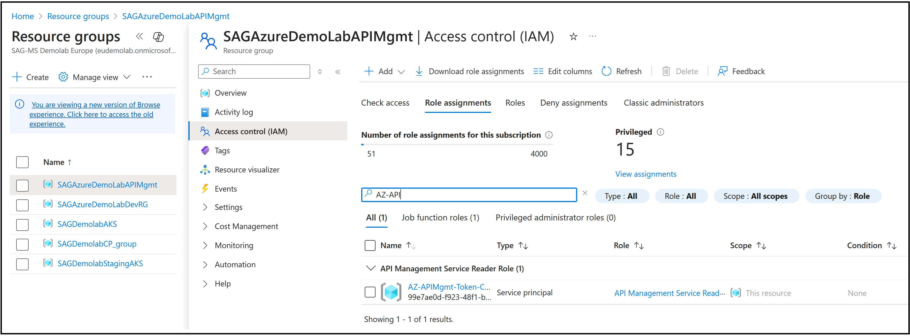

## A guide for implementing WxMCP-Tool-Catalog API for Azure API Management

## Table of Contents

- [1. Overview](#1-overview)  
- [2. Step-by-Step instructions](#2-step-by-step-instructions)  
- [3. Named Values](#3-named-values)  
  - [3.1. Storage Recommendations](#3.1-storage-recommendations)  
- [5. Dependencies](#5-dependencies)  
- [6. Access Rights and Role Assignment](#6-access-rights-and-role-assignment)

## 1. Overview
This directory contains Azure API Management (APIM) policy fragments for the **MCP-Tool Catalog API** implementation. These policies interact with Azure Admin APIs to retrieve API metadata, product information, and more. The configuration relies on several named values for secure and flexible operation.

---
## 2. Step-by-Step instructions

- Import the **MCP-Tool Catalog API** from this GitHub repository ([Specification](../../WxMCP-Tool-Catalog-1-1.yml)) into Azure API Management (APIM).
- Define a **Managed Identity** or custom **App Registration** with sufficient privileges to access the APIM APIs.
- Define the named values as described below.
- For the **MCP-Tool Catalog** API, apply the policy fragment ([general.xml](./policyFragments/general.xml)) to *All Operations -> Inbound Processing -> Policies* to set variables and acquire access tokens.
Adapt the JWT Token validation according to your settins (especially the *audience*). This is optional, you can also acess with API key only.
- Apply policy fragments to respective operations (*Inbound Processing -> Policies*):
    - `getServerDetails` ([productInfo.xml](./policyFragments/productInfo.xml))
    - `getAPIById` ([apiInfo.xml](./policyFragments/apiInfo.xml))
     - `downloadOpenAPISpecificationByID` ([downloadOpenAPISpecification.xml](./policyFragments/downloadOpenAPISpecification.xml))
- Include the **MCP-Tool Catalog API** in all API products along with other APIs, and add subscriptions as needed.
- Note: If additional inbound OAuth security policies are defined, the API Key must still be provided to allow metadata access.
- Ensure that **MCP-Tool Catalog API** has tag *mcp.ignore* assigned (configured under "Settings" in the API). This ensures that MCP-Tool Catalog is not offered as MCP tools to MCP clients
- You can use the tag *mcp.object.name:YOUR_OBJECT* to tell **WxMCPServer** to add a prefix consisting of the object name and "_" before each tool (aka API operation)

---
## 3. Named Values

The following named values must be configured in APIM for these policies to function:

| Named Value           | Role / Usage                                                                                  |
|-----------------------|----------------------------------------------------------------------------------------------|
| `aadClientId`         | Optional: Azure AD App Registration client ID to access admin APIs (only needed if no managed identity is used) using OAuth           |
| `aadClientSecret`     | Optional: Azure AD App Registration client secret to access admin APIs (only needed if no managed identity is used) using OAuth           |
| `aadTenantId`         | Azure AD Tenant ID used to construct token endpoint URLs                                     |
| `azureSubscriptionId` | Azure Subscription ID used to build Azure Resource Manager (ARM) API URLs                                             |
| `resourceGroup`       | Name of the Azure Resource Group containing the APIM instance                                |
| `serviceName`         | Name of the Azure API Management (APIM) service instance                                     |

### 3.1. Storage Recommendations
- Store `aadClientSecret` as a **secret** named value in APIM.
- Store all others as **string** named values.
---
## 5. Dependencies

These policy fragments depend on the following Azure Admin APIs and endpoints:

| HTTP Method | API Endpoint                                                                                                                      | Purpose/Action                   |
|-------------|----------------------------------------------------------------------------------------------------------------------------------|---------------------------------|
| GET         | `/subscriptions/{subscriptionId}/resourceGroups/{resourceGroup}/providers/Microsoft.ApiManagement/service/{serviceName}/apis/{apiId}?api-version=2024-05-01`                      | Retrieve API metadata            |
| GET         | `/subscriptions/{subscriptionId}/resourceGroups/{resourceGroup}/providers/Microsoft.ApiManagement/service/{serviceName}/apis/{apiId}?export=true&format=openapi-link&api-version=2024-05-01` | Export OpenAPI/Swagger specification |
| GET         | `/subscriptions/{subscriptionId}/resourceGroups/{resourceGroup}/providers/Microsoft.ApiManagement/service/{serviceName}/apis/{apiId}/tags?api-version=2024-05-01`                | Retrieve API tags                |
| GET         | `/subscriptions/{subscriptionId}/resourceGroups/{resourceGroup}/providers/Microsoft.ApiManagement/service/{serviceName}/subscriptions/{subscriptionId}?api-version=2021-08-01`   | Retrieve APIM subscription details |
| GET         | `/subscriptions/{subscriptionId}/resourceGroups/{resourceGroup}/providers/Microsoft.ApiManagement/service/{serviceName}/products/{productId}?api-version=2024-05-01`              | Retrieve APIM product details    |
| GET         | `/subscriptions/{subscriptionId}/resourceGroups/{resourceGroup}/providers/Microsoft.ApiManagement/service/{serviceName}/products/{productId}/apis?api-version=2024-05-01`          | List APIs assigned to a product  |
| POST        | `https://login.microsoftonline.com/{aadTenantId}/oauth2/v2.0/token`                                                               | Obtain Azure AD access token via OAuth 2.0 client credentials flow  |

---
## 6. Access Rights and Role Assignment

To access all referenced APIs, the identity (App Registration or Managed Identity) must have:

- **Azure Role Assignment:**
  - Assign the built-in role **API Management Service Reader** at the APIM instance or resource group level (least privilege, sufficient for all read operations).
    - Alternatively, the **Reader** role is also sufficient but broader.
    - For write/management operations, use **API Management Service Contributor** or **Contributor** (not required for current policies).

- **Azure Portal: Role assignment of Service principal to APIM resource group**

- **API Permissions (OAuth Scope):**
  - If using JWT validation on top, ensure the `scp` claim includes `mcp.tools.list` as required by the policy.

---
